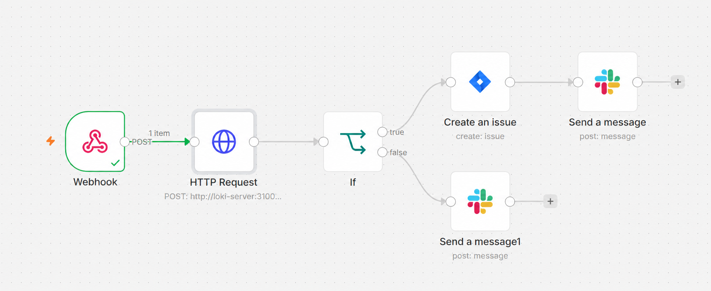
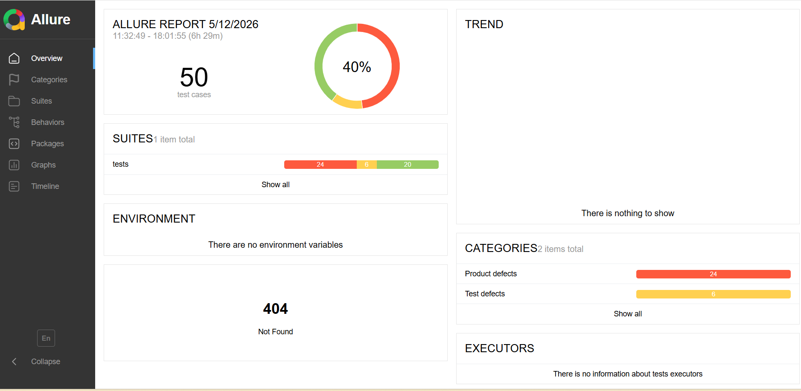

# Parkly QA Automation Assignment

This repository contains the automated test suite and exploratory testing findings for the Parkly application.

## Repository Structure

- `test-plan.md` - Details the testing strategy, exploratory approach, and a comprehensive report of the 15 bugs identified.
- `tests/` - Contains the Python Playwright automated tests.
  - `test_e2e_scenarios.py` - Core E2E automated scenarios requested in Part 2.
  - `test_bugs.py` - The main test file containing 15 specific tests reproducing the found bugs.
  - `test_accessibility.py` - Automated accessibility tests.
  - `test_api.py` - Backend-oriented API tests (auth, security, logic).
- `pages/` - Page Object Model (POM) implementation.
- `conftest.py` - Pytest configuration, Playwright fixture setup, and **n8n TestOps Webhook Integration**.
- `pytest.ini` - Test runner configuration.
- `ai-reflection.md` - A detailed reflection on how AI was used as a "Pair Programmer" for architecture, debugging, and automation.
- `accessibility_report.md` - A specialized report on WCAG compliance and accessibility findings.
- `n8n_testops_workflow.json` - The exportable n8n workflow definition for the TestOps pipeline.
- `requirements.txt` - Python dependencies required to run the suite.

## Automation Features (Part 2)

**Automation Choices & Reasoning:**
I chose to automate the **Full E2E Parking Lifecycle** (Happy Path) and the **Duplicate Parking Prevention** (Negative Path). 
*Why?* The happy path ensures that the core business value (revenue generation via parking sessions) is functional. If this breaks, the product is useless. The negative path was chosen because starting overlapping sessions is a critical data integrity risk. I prioritized these high-impact flows over automating minor UI validations, ensuring the automation suite provides maximum ROI.

**n8n Webhook Integration (TestOps):**

As part of a modern TestOps infrastructure, this project includes a Pytest hook (inside `conftest.py`) that captures the test execution results (Passed/Failed/Skipped) and sends a JSON payload to an `n8n` Webhook upon completion. In a production environment, n8n would parse this payload and automatically trigger Slack alerts or create Jira bugs based on the failure rate.

**E2E Scenarios Automated:**
1. **Full Parking Lifecycle (Happy Path):** Validates the absolute core business value (Login -> Start Parking -> End Parking -> Verify in History).
2. **Duplicate Parking Prevention (Negative Path):** Validates strict business logic by attempting to start two concurrent sessions for the exact same vehicle, asserting that the system throws a proper validation error.


## Reporting (Trace & Allure)



- **Playwright Trace:** Configured to `retain-on-failure`. Generates a full DOM/Network snapshot for debugging failed tests.
- **Allure Reports:** Generates management-level reporting. To view: `allure serve allure-results`.

## Bug Report & Deep Dive Analysis

Using the integrated **Playwright Trace Viewer**, I performed a Root Cause Analysis (RCA) on the failures identified by the automated suite:

### Issue 1: Path Encoding (404 Broken Images)
- **Discovery**: Identified via automated **Console Error Audit** and Playwright Trace Viewer.
- **Root Cause Analysis (RCA)**: By analyzing the Network Tab, I identified a path-encoding issue in resource URLs (e.g., `uploads/uploads%5CWhatsApp...`). The character `%5C` is a URL-encoded backslash (`\`).
- **Technical Insight**: The backend (Flask on Windows) generates file paths with backslashes, but the browser expects forward slashes (`/`). This mismatch breaks image loading in the Parking History module.

### Issue 2: Deferred Error Notification (State Persistence Bug)
- **Behavior**: When invalid credentials are entered, the Login page provides zero visual feedback, leaving the user confused.
- **Root Cause Analysis (RCA)**: The "Invalid credentials" error messages are successfully generated by the backend and stored in the session, but the Login UI fails to display them. These "latent" messages only appear **after** a subsequent successful login, cluttering the Dashboard with outdated error notifications.
- **Impact**: Severe UX flaw; users may attempt multiple logins without knowing why they are failing, only to be greeted by a list of old errors once they finally succeed.

## AI-Augmented Development
This project demonstrates a modern approach to QA, where AI agents function as autonomous pair-programmers. AI was utilized for:
- **Autonomous Bug Hunting**: Discovering edge cases through DOM exploration.
- **Architectural Refactoring**: Migrating legacy code to a robust **Page Object Model**.
- **Accessibility Testing**: Automating WCAG compliance checks.
- **TestOps Design**: Integrating test results with external CI/CD and automation tools (n8n).

## Setup Instructions

1. **Install Python 3.8+**
2. **Clone the repository**
3. **Install Dependencies:**
   ```bash
   pip install -r requirements.txt
   ```
4. **Install Playwright Browsers:**
   ```bash
   playwright install chromium
   ```

## Running the Tests

Ensure the Parkly Docker container is running locally on `http://localhost:5000/`.

### 1. Bug Reproduction Suite (Identify Defects)
This suite contains 15 specific tests designed to fail, each reproducing a verified bug identified during exploratory testing.
```bash
pytest tests/test_bugs.py -v
```

### 2. E2E Business Scenarios (Automation Coverage)
This suite covers the core business flows, including the full parking lifecycle and system-wide console audit.
```bash
pytest tests/test_e2e_scenarios.py -v
```

### 3. Backend API Testing (Backend Oriented)
This suite bypasses the UI and tests the backend server endpoints directly using HTTP requests, verifying authentication and security.
```bash
pytest tests/test_api.py -v
```

### 4. Accessibility Audit
Automated checks for WCAG compliance and accessibility best practices.
```bash
pytest tests/test_accessibility.py -v
```

### 5. Full Suite
To run all tests in the project (E2E, API, Bugs, Accessibility):
```bash
pytest -v
```

## CI/CD Integration
This repository includes a fully configured **GitHub Actions** workflow (`.github/workflows/qa_pipeline.yml`). It is designed to automatically trigger the `pytest tests/` command on every push and pull request, uploading the `allure-results` as a build artifact.

**The pipeline automatically executes all test suites:**
1. `test_api.py` - Backend & Security API Tests
2. `test_bugs.py` - 15 Bug Reproduction Tests
3. `test_e2e_scenarios.py` - Happy & Negative E2E Flows
4. `test_accessibility.py` - WCAG Accessibility Checks
